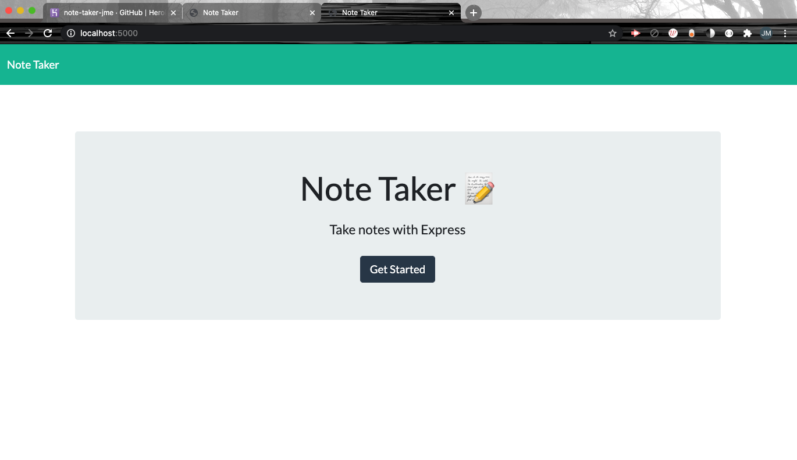
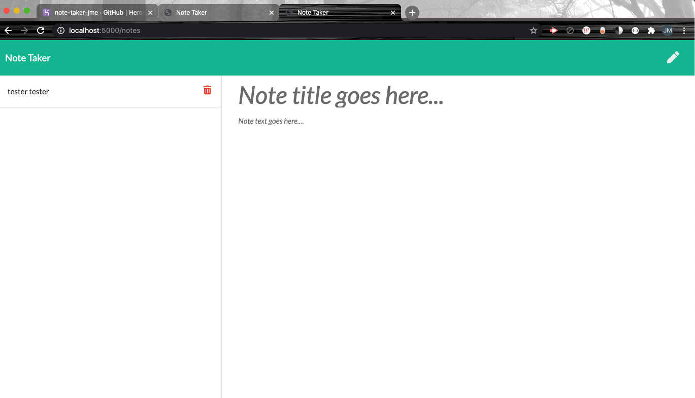
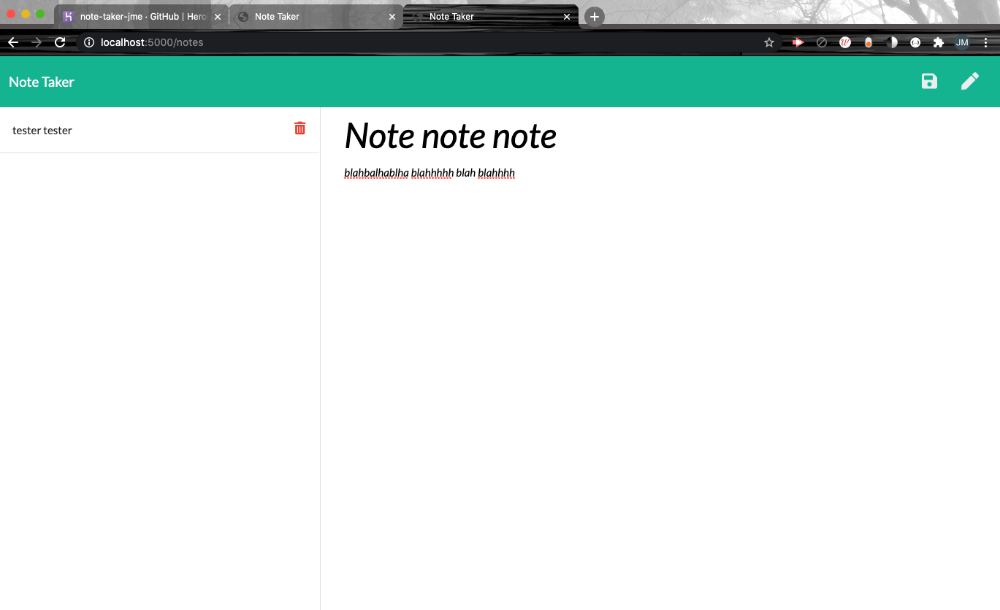
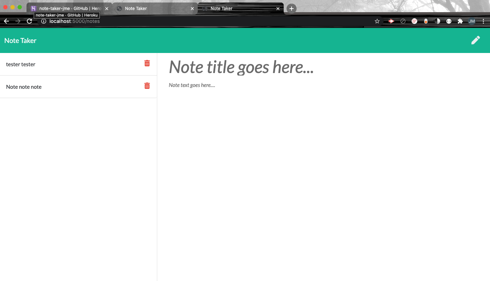
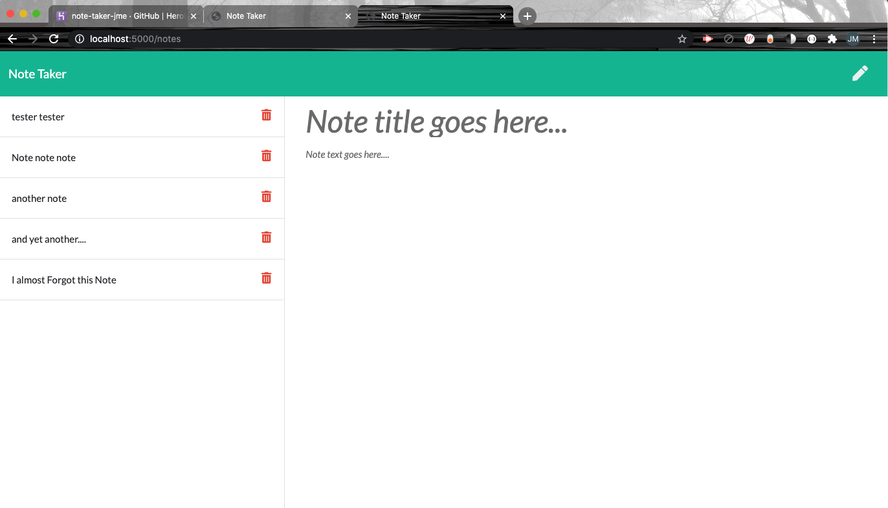

# Project Name  
 Note Taker

  ## Overview 
  An application that can be used to write, save, and delete notes deployed with Heroku (or on localhost). This application will use an express backend and save and retrieve note data from a JSON file.  Need help remembering what you need to do?  This is the app for you!

  ## Table of Contents:
  - [Links](#Links)
  - [Screenshots_and_GIFs](#Screenshots_and_GIFs)
  - [Motivation](#Motivation)
  - [Installation](#Installation)
  - [How_to_use](#How_to_use)
  - [Benefit](#Benefit)
  - [License](#License)
  - [Tests](#Tests)
  - [Contribute](#Contribute)

 ## Links
  - (https://jmeggles.github.io/11_Note_Taker/)
  - (https://github.com/jmeggles/11_Note_Taker)

 ## Screenshots_and_GIFs 
 First vid shows this deployed with Herkou while screenshots show local host accessibility. 
  -  
  -  
  -  
  -  
  -   
  - 
  -   
  - 
  
  ## Motivation
  Note Taker is to help keep us be organized and remember to do half the stuff we forget to do.  I tend to make lists for things that need to be done around the house...  "Fix this now, fix that later, replace this soon, get this at the store, look into that at some point", etc.  I can't remeber it all so the Note Taker is the best way to keep those lists, ideas (or chores) in one place to come back to for future reference.      

  ## Installation  
  - Heroku
  - Node express
  - HTML
  - CSS
  - JavaScript
  
  ## How_to_use
  This application can be used through Heroku https://note-taker-jme.herokuapp.com/) but can also be accessed by cloning this app from GitHub and using local host 5000 in your server and running node server,js in the terminal. 
  Begin application by clicking the Get Started button on the first page. Write a title for the note in the bold text line and the note test below it.  To save, click the save icon in the upper right corner (icon appears after note has been started).  To begin a new note click the pencil in the upper right corner.  To view notes, as they are saved they will appear in the left clumn and can be clicked on to view entire note, or to delete click the trash icon next to that note.  All notes will be saved until deleted even when you come back to the app after closing or refreshing!

  ## Benefit
  Anyone who needs to be more organized or is forgetful will benefit greatly from this Note Taker app but it works well for everyone!

  ## License 
  MIT

  ## Credits
  John Dinsmore, Jorge Alvarez, Ben Benson WebDev Tutoring, W3 Schools (https://www.w3schools.com/js/), Mozilla (https://developer.mozilla.org/en-US/).

  ## Tests
  No pre-work testing was done with this application. However, nodemon and console logs were often used to be sure lines of code were executing correctly.  

  ## Contribute
  Yes. Commit or comment to the project in github.

  © Copyright 2020

